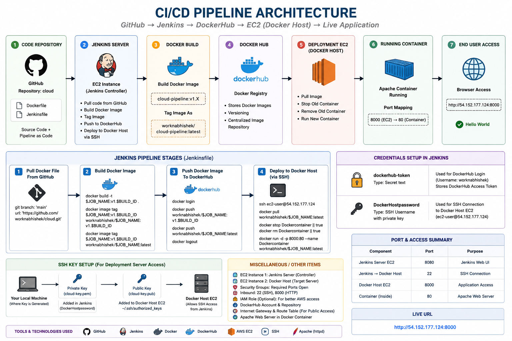

# 🚀 End-to-End CI/CD Pipeline with Jenkins, Docker, DockerHub & AWS EC2


## 📌 Project Overview

This project demonstrates a complete end-to-end CI/CD pipeline built using:

- GitHub
- Jenkins
- Docker
- DockerHub
- AWS EC2
- SSH Agent & Jenkins Credentials

The pipeline automatically:

1. Pulls source code from GitHub
2. Builds a Docker image
3. Tags the image with versioning
4. Pushes the image to DockerHub
5. Connects to a remote EC2 Docker Host through SSH
6. Deploys the latest container automatically
7. Exposes the live application through the browser

This project was built to gain hands-on experience with real-world DevOps workflows, automation, CI/CD concepts, containerization, deployment pipelines, Linux troubleshooting, and infrastructure communication.

---

# 🎯 Goal of the Project

The primary objective of this project was to understand how modern DevOps pipelines work beyond theory.

Instead of only learning commands individually, this project focused on integrating multiple technologies together into a working deployment workflow.

The goal was to simulate a production-style environment where:

- Source code lives in GitHub
- Jenkins acts as the CI/CD controller
- Docker is used for containerization
- DockerHub acts as the image registry
- AWS EC2 hosts the deployment environment
- Deployments happen automatically through SSH

---

# 🏗️ Architecture Overview

## Architecture Diagram



## High-Level CI/CD Flow

```text
GitHub Repository
        ↓
     Jenkins
(CI/CD Controller)
        ↓
 Docker Image Build
        ↓
 DockerHub Registry
        ↓
SSH Deployment
        ↓
 Docker Host EC2
        ↓
 Running Container
        ↓
 Browser Access
```

---

# 🧩 Architecture Components

## 1️⃣ GitHub Repository

Repository Name:

```text
cloud
```

Contains:

- Dockerfile
- Jenkinsfile
- Source Code

Acts as:

- Version Control
- Source Code Management
- Pipeline as Code

---

## 2️⃣ Jenkins Server (EC2)

Acts as the CI/CD controller.

Responsibilities:

- Pull source code from GitHub
- Build Docker image
- Tag images
- Push images to DockerHub
- Connect to deployment server through SSH
- Trigger automated deployments

---

## 3️⃣ Docker Build Process

Docker images are built dynamically during pipeline execution.

Image Versioning Example:

```text
cloud-pipeline:v1.6
cloud-pipeline:v1.7
cloud-pipeline:v1.8
cloud-pipeline:v1.10
```

Additional Tags:

```text
worknabhishek/cloud-pipeline:latest
```

This demonstrates Docker image tagging and version management.

---

## 4️⃣ DockerHub Registry

DockerHub acts as a centralized container registry.

Responsibilities:

- Store Docker images
- Maintain image versions
- Serve images to deployment server
- Enable image portability

---

## 5️⃣ Deployment Server (Docker Host EC2)

A separate EC2 instance used as the runtime environment.

Responsibilities:

- Pull latest image from DockerHub
- Stop old container
- Remove previous container
- Deploy updated container
- Expose application through browser

This separation between Jenkins and Deployment Host simulates real production-style infrastructure.

---

## 6️⃣ Running Docker Container

The application runs inside a Docker container using Apache.

Port Mapping:

```text
EC2 Port 8000  →  Container Port 80
```

Application Access:

```text
http://54.152.177.124:8000
```

---

# 🔐 Credentials & Security Configuration

## Jenkins Credentials Used

### DockerHub Access Token

Credential ID:

```text
dockerhub-token
```

Purpose:

- Authenticate DockerHub login
- Push Docker images securely

---

### SSH Private Key Credential

Credential ID:

```text
DockerHostpassword
```

Type:

```text
SSH Username with private key
```

Purpose:

- Allow Jenkins to securely SSH into Docker Host EC2
- Used through Jenkins SSH Agent Plugin

---

# 🔑 SSH Authentication Flow

```text
Local Machine
    ↓
Generate cloud.pem
    ↓
Private Key stored in Jenkins Credentials
    ↓
Public Key added to Docker Host EC2
    ↓
Jenkins uses SSH Agent Plugin
    ↓
Secure deployment to EC2
```

---

# 🌐 Port Configuration

| Component | Port | Purpose |
|---|---|---|
| Jenkins UI | 8080 | Jenkins Dashboard |
| SSH | 22 | Remote Server Access |
| Docker Host | 8000 | Browser Access |
| Container | 80 | Apache Web Server |

---

# ⚙️ Jenkins Pipeline Stages

## Stage 1 — Pull Docker File From GitHub

Jenkins pulls latest code from GitHub repository.

```groovy
stage("Pull Docker File From GitHub") {

    git branch: 'main',
        url: 'https://github.com/worknabhishek/cloud.git'
}
```

---

## Stage 2 — Build Docker Image

Builds Docker image and creates version tags.

```groovy
stage('Build Docker Image') {

    sh 'docker build -t $JOB_NAME:v1.$BUILD_ID .'

    sh 'docker image tag $JOB_NAME:v1.$BUILD_ID worknabhishek/$JOB_NAME:v1.$BUILD_ID'

    sh 'docker image tag $JOB_NAME:v1.$BUILD_ID worknabhishek/$JOB_NAME:latest'
}
```

---

## Stage 3 — Push Docker Image

Pushes Docker images to DockerHub securely using Jenkins credentials.

```groovy
stage('Push Docker Image') {

    withCredentials([string(credentialsId: 'dockerhub-token', variable: 'DOCKER_TOKEN')]) {

        sh 'echo $DOCKER_TOKEN | docker login -u worknabhishek --password-stdin'

        sh 'docker push worknabhishek/$JOB_NAME:v1.$BUILD_ID'

        sh 'docker push worknabhishek/$JOB_NAME:latest'

        sh 'docker logout'
    }
}
```

---

## Stage 4 — Deploy Container in Docker Host

Jenkins deploys the latest container to remote EC2 through SSH.

```groovy
stage('Deploy Container in Docker Host') {

    sshagent(['DockerHostpassword']) {

        sh '''
        ssh -o StrictHostKeyChecking=no ec2-user@54.152.177.124 << EOF

        docker pull worknabhishek/$JOB_NAME:latest

        docker stop Dockercontainer || true

        docker rm Dockercontainer || true

        docker run -d -p 8000:80 --name Dockercontainer worknabhishek/$JOB_NAME:latest

        EOF
        '''
    }
}
```

---

# 🛠️ Major Problems Faced & Troubleshooting

This project involved significant debugging and troubleshooting throughout the setup process.

---

## ❌ Docker Command Syntax Errors

### Problem

Incorrect Docker command:

```bash
docker iamge build
```

### Fix

Corrected to:

```bash
docker image build
```

Learned the importance of command syntax validation.

---

## ❌ Docker Permission Denied Error

### Problem

```text
permission denied while trying to connect to the Docker daemon socket
```

### Cause

Jenkins user was not added to Docker group.

### Fix

```bash
sudo usermod -aG docker jenkins
sudo systemctl restart jenkins
```

---

## ❌ DockerHub Push Failures

### Problem

Image tags did not exist during push stage.

### Cause

Build stage was accidentally replaced instead of added.

### Fix

Restored complete multi-stage pipeline.

---

## ❌ SSH Authentication Failure

### Problem

```text
error in libcrypto
```

### Cause

Malformed PEM key inside Jenkins credentials.

### Fix

- Replaced corrupted SSH private key
- Reconfigured Jenkins SSH credentials
- Verified SSH Agent setup

---

## ❌ Deployment Container Already Exists

### Problem

Container deployment failed because previous container already existed.

### Fix

Added:

```bash
docker stop Dockercontainer || true

docker rm Dockercontainer || true
```

before running new container.

---

## ❌ EC2 Docker Access Issues

### Problem

Remote EC2 user could not execute Docker commands.

### Fix

```bash
sudo usermod -aG docker ec2-user
```

Configured proper Docker group permissions.

---

# 📸 Project Highlights

✅ Automated CI/CD Pipeline

✅ Pipeline as Code using Jenkinsfile

✅ Secure Credential Management

✅ SSH Agent Integration

✅ Docker Image Versioning

✅ DockerHub Registry Integration

✅ Automated EC2 Deployment

✅ Remote Container Management

✅ Linux Troubleshooting

✅ End-to-End Deployment Automation

---

# 📚 Key Concepts Learned

Throughout this project, the following concepts were explored and implemented:

- CI/CD Fundamentals
- Jenkins Pipelines
- Docker Containerization
- Docker Image Tagging
- DockerHub Registry Management
- SSH Agent Authentication
- Jenkins Credentials Management
- Linux Permissions & User Groups
- AWS EC2 Infrastructure
- Automated Remote Deployment
- Infrastructure Separation
- Pipeline as Code
- Container Lifecycle Management

---

# 🧠 Key Takeaways

This project provided practical exposure to how modern deployment pipelines work in real environments.

The biggest learning was understanding how multiple DevOps tools integrate together into a complete workflow rather than existing as isolated technologies.

The project also reinforced the importance of:

- troubleshooting skills
- infrastructure communication
- secure secret handling
- deployment automation
- Linux fundamentals

---

# 🚀 Future Improvements

Potential future enhancements:

- GitHub Webhooks for automatic pipeline triggers
- Docker Compose integration
- Kubernetes deployment
- Terraform infrastructure provisioning
- NGINX reverse proxy
- HTTPS & domain configuration
- Monitoring & logging integration
- Multi-container architecture

---

# 🧰 Tech Stack

| Technology | Purpose |
|---|---|
| GitHub | Source Control |
| Jenkins | CI/CD Automation |
| Docker | Containerization |
| DockerHub | Container Registry |
| AWS EC2 | Infrastructure |
| SSH Agent | Secure Deployment |
| Linux | Server Environment |
| Apache | Web Server |

---

# 📂 Repository Structure

```text
cloud/
├── Dockerfile
├── Jenkinsfile
└── README.md
```

---

# 🎉 Final Result

The final pipeline successfully:

✅ Pulled code from GitHub

✅ Built Docker image automatically

✅ Pushed image to DockerHub

✅ Connected securely to remote EC2

✅ Deployed updated container automatically

✅ Served live application through browser

---

# 📎 Live Application

```text
http://54.152.177.124:8000
```

---

# 👨‍💻 Author

**Abhishek Rathore**

Aspiring DevOps Engineer passionate about automation, cloud infrastructure, CI/CD pipelines, containerization, and Linux systems.

